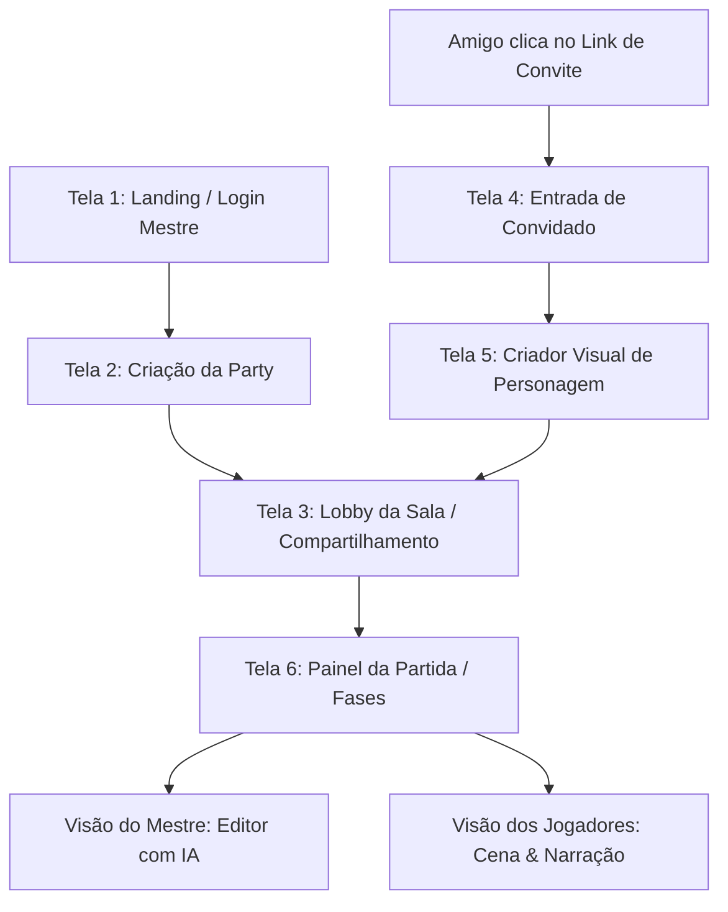

# ⚔️ RPG Party & Master Lore AI — Especificação do Produto & Backend

> **Documento de Arquitetura, Guia de Telas para UI/UX Designers e Roadmap de Produto.**  
> Este documento detalha tudo o que já está desenvolvido no backend, como o fluxo do jogo opera, todos os parâmetros visuais disponíveis para o design de interface e as futuras funcionalidades (Chat em tempo real e Voz por WebRTC).

---

## 🧭 Visão Geral do Produto

A plataforma é um **ambiente virtual para jogar RPG de mesa com amigos de forma simplificada e interativa** (no estilo sala de jogos / lobby compartilhado).

- **O Mestre (GM)** cria a Party, escolhe a temática da campanha e compartilha o link com os amigos.
- **Os Jogadores** entram na sala através do link ou código, escolhem nome/senha e montam seus personagens através de um **criador visual minucioso** (skins, raça, roupas, armas, paletas de cores).
- **A Partida progride por Fases**:
  - O Mestre digita as anotações do que acontece em cada fase.
  - A **IA auxilia o Mestre** organizando as anotações em uma narração imersiva de RPG, determinando a atmosfera sensorial e sugerindo desafios/ganchos, **sem alterar o enredo do Mestre**.
  - A IA gera uma **ilustração conceitual da cena** para cada fase.

---

## 🎨 Guia para o UI/UX Designer: Telas & Componentes

O designer de interface deve projetar a experiência visual com base nas telas e estados descritos abaixo.



---

### 🖥️ Tela 1: Autenticação & Cadastro do Mestre
- **Objetivo**: Entrada do Mestre da mesa.
- **Campos**: Nome de usuário, e-mail e senha.
- **Ações**: Cadastrar Mestre, Login e "Entrar como Jogador com Código de Sala".
- **Endpoints Prontos**:
  - `POST /api/auth/register-master`
  - `POST /api/auth/login-master`

---

### 🖥️ Tela 2: Criação da Party & Escolha de Temática
- **Objetivo**: O Mestre configura a nova aventura.
- **Campos**:
  - **Título da Campanha** (ex: *"A Maldição do Castelo Sombrio"*).
  - **Seletor de Temática** (Cards visuais estilizados com preview de artes e cores):
    1. *Fantasia Medieval & Masmorras*
    2. *Cyberpunk Distópico 2088*
    3. *Terror Cósmico & Mistério Vitoriano*
  - **Descrição da Aventura** (opcional).
  - **Senha da Sala** (opcional, para partidas privadas).
- **Feedback Visual**: Exibir o badge da temática selecionada, paleta de cores recomendada e resumo do estilo narrativo.
- **Endpoint Pronto**: `POST /api/parties`

---

### 🖥️ Tela 3: Lobby de Espera (Aguardando Jogadores)
- **Objetivo**: Ponto de encontro antes do início da partida.
- **Componentes de Interface**:
  - **Código da Sala em Destaque** (ex: `RPG-8K2A`) com botão de clique para copiar.
  - **Botão "Copiar Link de Convite"** (`https://seusite.com/party/join/RPG-8K2A`).
  - **Grid de Cards dos Personagens na Sala**:
    - Avatar visual renderizado.
    - Nome do personagem e nome do jogador.
    - Raça, Classe e Vestimenta.
    - Indicador de status: **"Pronto" (verde)** ou **"Criando Personagem" (amarelo)**.
  - **Botão do Mestre**: "Iniciar Sessão / Ir para Fase 1" (ativo quando os amigos estiverem prontos).
- **Endpoints Prontos**:
  - `GET /api/parties/code/:code`
  - `PATCH /api/parties/:id/status`

---

### 🖥️ Tela 4: Criador Visual de Personagem (Character Customizer)
> **Esta é uma das telas mais importantes do produto.** A customização visual é central na experiência.

#### Componentes de UI Recomendados:
- **Painel Central / Esquerdo**: Preview em tempo real do avatar/skin do personagem que reage às alterações.
- **Painel Direito (Abas de Customização)**:

| Categoria | Tipo de Controle no UI | Valores Já Padronizados no Backend |
| :--- | :--- | :--- |
| **Gênero / Identidade** | Seleção por ícones/pills | `MASCULINO`, `FEMININO`, `ANDROGINO`, `OUTRO` |
| **Raça** | Dropdown ou Cards de Raça com arte | *Humano, Elfo Silvestre, Anão das Colinas, Tiefling, Draconato, Meio-Orc, Cyborg, Androide, Investigador, etc.* |
| **Tom de Pele** | Seletor de Paleta / Swatches de Cores | `#fbe3d5`, `#e4b590`, `#b97d55`, `#6b4423`, `#2d1c10`, `#8fa382`, etc. |
| **Estilo de Cabelo** | Grid de ícones / Ilustrações de cortes | *Raspado, Curto Desalinhado, Tranças Nórdicas, Longo e Sedoso, Coque Samurai, Ondulado, Moicano Neon* |
| **Cor do Cabelo** | Seletor de cores em círculos | Preto, Castanho, Loiro Platinado, Ruivo, Prata, Neon Cyan, etc. |
| **Cor dos Olhos** | Seletor de cores em círculos | Azul Safira, Âmbar, Violeta, Vermelho Biônico, Verde Esmeralda |
| **Porte Físico** | Sliders ou Cartões | *Esguio & Ágil, Atlético & Definido, Robusto & Imponente, Baixo* |
| **Traje / Armadura (Skin)** | Carrossel de skins com visual | *Armadura de Placas, Cota de Malha, Traje de Couro, Túnica Arcana, Sobretudo Neon, Terno Vitoriano* |
| **Cores da Roupa** | Duas paletas (Primária e Secundária) | Cores sólidas e contrastantes |
| **Arma Principal** | Dropdown / Grid de Armas | *Espada Longa, Arco Composto, Cajado de Cristal, Adagas Duplas, Pistola Smart, Katana Térmica, Revólver* |
| **Cabeça / Elmo** | Grid de opções com miniatura | *Sem Elmo, Capuz Sombrio, Elmo Fechado, Diadema Élfica, Óculos HUD, Cartola* |
| **Acessórios** | Checkboxes com itens visíveis | *Capa Longa, Amuleto de Fé, Cinto de Alquimia, Drones de Vigia, Coldres* |
| **Traços Faciais** | Campo livre ou badges | *Cicatriz no olho direito, barba viking, tatuagem rúnica, implante laser* |

- **Endpoints Prontos**:
  - `GET /api/themes/:key` (retorna as opções visuais exatas da temática ativa)
  - `POST /api/parties/:partyId/characters`
  - `PATCH /api/characters/:id`
  - `PATCH /api/characters/:id/ready`

---

### 🖥️ Tela 5: Painel da Partida — Telas de Fase (Gameplay)

A tela de jogo é dividida de acordo com o papel do usuário:

#### 1. Visão do Mestre (Dashboard do Mestre):
- **Campo de Anotações Livres do Mestre**: Área de texto para o Mestre digitar os acontecimentos daquela fase (inimigos que chegam, reviravolta, perigos na sala).
- **Botão "Pedir Toque de RPG à IA"**:
  - Chama o backend que estrutura a cena em texto narrativo imersivo.
  - Gera os ganchos táticos para os jogadores.
- **Pré-visualização da Narração**: O mestre pode revisar ou clicar em "Regenerar Narração".
- **Ilustração da Fase gerada por IA**: Visualização da imagem gerada, com botão "Regenerar Imagem".
- **Botão "Publicar Fase para os Jogadores"**: Faz a fase aparecer instantaneamente na tela dos amigos.
- **Botão "Avançar para Próxima Fase"**.

#### 2. Visão dos Jogadores:
- **Banner Imersivo da Cena**: Imagem em alta resolução gerada por IA para a fase atual.
- **Quadro de Narração do Mestre**: Texto narrativo atmosférico da fase.
- **Clima / Atmosfera**: Badge sensorial (ex: *"Tensa, névoa espessa, iluminação de tochas crepitando"*).
- **Barra Lateral do Grupo**: Lista de todos os personagens da sala com seus avatares e status de vida/energia.

---

## 🔮 Funcionalidades Futuras (Roadmap de Design & Features)

Estas funcionalidades foram mapeadas para as próximas etapas de desenvolvimento:

### 1. 💬 Chat em Tempo Real na Party
- **Especificação de UI**:
  - Gaveta retrátil lateral ou card inferior flutuante na tela da partida.
  - **Canais**:
    - **Geral**: Conversa aberta entre todos os jogadores e o mestre.
    - **Sussurros (Whisper)**: Mensagens privadas entre um jogador específico e o Mestre (essencial para segredos de RPG).
    - **Rolagem de Dados no Chat**: Comando `/roll 1d20+5` ou `/dado` exibindo animação 3D de dados ou card visual com o resultado crítico (sucesso ou falha).
- **Tecnologia Planejada no Backend**: NestJS WebSockets (`@nestjs/websockets` + Socket.io).

### 2. 🎙️ Comunicação por Voz Integrada (Voice Chat)
- **Especificação de UI**:
  - Indicador de anel luminoso verde ao redor do avatar do jogador que estiver falando no momento.
  - Barra de controle rápido de áudio no rodapé:
    - Botão **Mutar Microfone** (`Ctrl + M`).
    - Botão **Desativar Áudio Geral / Deafen** (`Ctrl + D`).
    - Slider de volume individual por jogador (clicando no card do amigo).
  - Badge especial de "Canal de Voz Conectado" com latência (ping).
  - **Voz Prioritária do Mestre**: Quando o Mestre fala, o volume dos jogadores é levemente atenuado (Duck Audio) para garantir que as narrações sejam ouvidas.
- **Tecnologia Planejada**: WebRTC P2P ou servidor SFU (LiveKit / Agora Cloud) integrado via token temporário gerado pelo backend.

### 3. ⚡ Integração Frontend com Zod & TanStack
- **Validação de Formulários**: Todos os schemas do criador de personagens e salas usando **Zod** para validação instantânea no navegador antes de enviar ao servidor.
- **Gerenciamento de Estado**: **TanStack Query (React Query)** para sincronização automática do estado do lobby, novos jogadores entrando e atualizações de fases sem recarregar a página.

---

## 🛠️ O Que Já Está Pronto no Backend (Backend Status)

| Módulo | Status | Detalhes |
| :--- | :---: | :--- |
| **Arquitetura Hexagonal** | ✅ 100% | Domínio isolado, Inbound/Outbound Ports, Adapters e Injeção de Dependências limpa. |
| **Modelos MongoDB (Prisma)** | ✅ 100% | Schemas de `User`, `Party`, `Character` (aparência rica) e `Phase` (IA e imagem). |
| **Autenticação & Tokens** | ✅ 100% | JWT com bcrypt para Mestres e Sessão Temporária para Jogadores convidados via sala. |
| **Catálogo de Temáticas & Skins** | ✅ 100% | Presets de Fantasia Medieval, Cyberpunk e Terror Cósmico com raças, roupas e paletas. |
| **Lobby & Gestão de Salas** | ✅ 100% | Criação de sala, códigos de 6 caracteres únicos e links de convite diretos. |
| **Criação Visual de Personagem** | ✅ 100% | Endpoints para salvar todas as propriedades de skin, arma, vestimenta e cores. |
| **IA Lore Enhancer** | ✅ 100% | Organiza as notas do mestre em prosa de RPG e cria atmosfera/ganchos (OpenAI/Gemini/Motor Nativo). |
| **Gerador de Imagens da Cena** | ✅ 100% | Gera arte conceitual da fase por IA (DALL-E e Fallback Visual de Alta Definição). |
| **Adaptação para Vercel** | ✅ 100% | `api/index.ts` serverless handler, `vercel.json` e script de build configurados. |
| **Documentação Interativa (Swagger)** | ✅ 100% | Disponível em `/docs` com todos os endpoints testáveis. |
| **Testes Automatizados E2E** | ✅ 100% | Testes e2e configurados e passando no Jest. |

---

## 🚀 Executando o Projeto

### Pré-requisitos
- Node.js 20+
- Conta/Instância no MongoDB (ex: MongoDB Atlas)

### Comandos

```bash
# 1. Instalar dependências
npm install

# 2. Configurar variáveis de ambiente
cp .env.example .env

# 3. Gerar o cliente Prisma
npm run prisma:generate

# 4. Iniciar em modo de desenvolvimento
npm run start:dev

# 5. Executar os testes
npm run test:e2e

# 6. Compilar para produção / Vercel
npm run vercel-build
```

- **API Base**: `http://localhost:3000/api`
- **Documentação Swagger Interativa**: `http://localhost:3000/docs`
